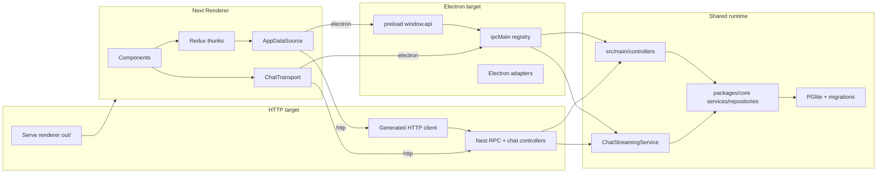

# Architecture

Cosmo Studio is a dual-runtime application with a static-exported Next.js UI. It can be packaged as an Electron desktop app or built as a local NestJS HTTP service from the same renderer, controller, streaming, and core code.

## High-level diagram

## Key responsibilities

### Main and HTTP runtime (`src/main`)

- Electron startup/lifecycle and `BrowserWindow` creation (`src/main/index.ts`).
- HTTP startup through NestJS (`src/main/http/index.ts`).
- Database initialization (`DatabaseManager.initialize(...)`) and migration execution for both targets.
- IPC registration: controllers are registered via `IpcHandlerRegistry` (`src/main/ipc/index.ts`).
- HTTP RPC registration: generated controller manifest drives `POST /api/rpc/:controller/:handler`.
- Chat streaming business flow in `src/main/services/ChatStreamingService.ts`.
- ACP agent process/runtime orchestration in `src/main/services/AcpAgentRuntimeService.ts`.
- Electron streaming delivery that needs `webContents.send` (`StreamingChatController`).
- HTTP streaming delivery through `src/main/http/ChatHttpController.ts`.
- Main logging (`src/main/logger.ts`) and update checks (`update-electron-app`).

### Preload (`src/preload`)

- Defines the renderer-accessible API surface (`window.api`) via `contextBridge`.
- `src/preload/api.ts` and `src/preload/api/*.ts` are generated from controller decorators using `scripts/generate-api.ts`.
- Applies only to the Electron target.

### Renderer (`src/renderer`)

- Next.js App Router UI.
- Owns a single root Redux store for renderer state.
- Renderer components should dispatch thunks/selectors instead of calling preload APIs directly.
- Production output is static (`next.config.ts` uses `output: "export"`), written to `src/renderer/out/`.
- Request/response data flows resolve a renderer-side app data source adapter first, so the same thunk layer can talk to Electron preload or the generated HTTP client.
- Direct `window.api` usage should stay isolated to renderer adapter/transport modules such as `src/renderer/src/lib/app-data-source.ts` and `src/renderer/src/chat-transport.ts`.
- `NEXT_PUBLIC_COSMO_BACKEND=electron|http` selects the runtime adapter at build/dev time.
- HTTP RPC calls use `src/renderer/src/lib/generated-http-api.ts`.

### Core package (`packages/core`)

- Shared DTOs and types (`packages/core/dto.ts`).
- Provider catalog metadata shared across processes (`packages/core/providerCatalog.ts`).
- ACP agent metadata, registry cache, and redacted DTOs for local Agent Client Protocol runtimes.
- Drizzle schema and DB manager (`packages/core/database/*`).
- Repositories and services (`packages/core/repositories/*`, `packages/core/services/*`).
- DI container (`packages/core/inversify.config.ts`) used as the parent container for main.
- Command registry and parsing utilities (`packages/core/commands/*`), including built-ins and user-defined commands stored in the DB.
- Runtime-agnostic platform seams in `packages/core/platform/*`, currently `SecretStore` and `CoreLogger`.

### Command flow (high-level)

1. Renderer dispatches command thunks from the root Redux store.
2. User submits a command (typed or selected).
3. The thunk resolves through the shared app data source adapter to preload or HTTP.
4. The active backend resolves the command through `CommandController` -> `CommandService`.
5. The resolved prompt is sent through the normal chat streaming pipeline.

### ACP agent flow (high-level)

1. Renderer loads installed agents and registry metadata through the generated `acpAgent` RPC group.
2. Agent definitions live in `AcpAgent`; registry responses are cached in `AcpRegistryCache`.
3. Secrets in agent environment variables stay encrypted through `SecretStore`; renderer responses only include env key names.
4. Chat sends either model metadata or agent metadata. `ChatStreamingService` branches on `runtime`.
5. Model chats keep the existing provider registry and MCP/web-search tools. Agent chats build an ACP provider in main/HTTP, pass selected MCP servers through the ACP session config, and stream through the same AI SDK UI message path.

## Build pipeline (how packaging works)

### Electron development (`npm run dev` / `npm run dev:electron`)

- Runs Next dev server (`src/renderer`) with `NEXT_PUBLIC_COSMO_BACKEND=electron` and Electron Forge start concurrently.
- Main loads the dev URL: `http://localhost:3000/splash` (see `src/main/index.ts`).

### HTTP development (`npm run dev:http`)

- Runs Nest on `127.0.0.1:4000` and Next dev on `localhost:3000`.
- Renderer uses `NEXT_PUBLIC_COSMO_BACKEND=http` and `NEXT_PUBLIC_COSMO_API_BASE=http://127.0.0.1:4000/api`.
- Nest enables CORS only for the local Next dev origins.

### Electron production (`npm run make` / `npm run package`)

1. Build renderer: `npm run build:renderer:electron`
    - Produces static output under `src/renderer/out/`.
2. Electron Forge packaging:
    - Vite plugin builds main and preload (`vite.main.config.ts`, `vite.preload.config.ts`).
    - `NextPlugin` copies `src/renderer/out/` into the packaged renderer directory.
    - `@electric-sql/*` is copied into the package so PGlite works at runtime.

### HTTP production (`npm run build:http` / `npm run start:http`)

1. Generate APIs: preload API, HTTP RPC manifest, and renderer HTTP client.
2. Build renderer: `npm run build:renderer:http`.
3. Vite builds the Nest entry from `src/main/http/index.ts` to `.vite/http/main.js`.
4. `vite.http.config.ts` copies `src/renderer/out/` to `.vite/http/public` and `migrations/` to `.vite/http/migrations`.
5. `npm run start:http` starts the built Nest service.

For the detailed accepted specs, see `docs/specs/dual-runtime/`.
