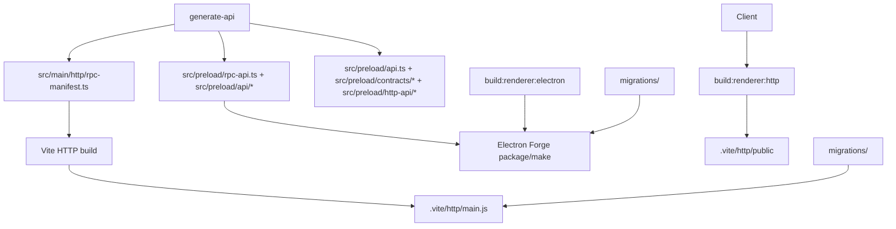

# Dual Runtime Spec: Build And Packaging

## Status

Accepted for v1. Electron packaging remains the existing shareable desktop app path. HTTP packaging produces a distributable Node service under `.vite/http`.

Electron installs also run `scripts/patch-electron-forge-plugin-vite.mjs` in root `postinstall` so Forge's preload build stays compatible with the current Vite version.

## Commands

| Command                           | Target   | Description                                                                   |
| --------------------------------- | -------- | ----------------------------------------------------------------------------- |
| `npm run dev`                     | Electron | Alias for `npm run dev:electron`.                                             |
| `npm run dev:electron`            | Electron | Starts Next dev with Electron backend env and Electron Forge.                 |
| `npm run dev:http`                | HTTP     | Starts Nest on port `4000` and Next dev on port `3000` with HTTP backend env. |
| `npm run generate-api`            | Both     | Generates preload API, HTTP RPC manifest, and renderer HTTP client.           |
| `npm run build:renderer:electron` | Electron | Static Next export configured for packaged Electron assets.                   |
| `npm run build:renderer:http`     | HTTP     | Static Next export configured for `/`.                                        |
| `npm run package`                 | Electron | Builds Electron renderer and packages through Electron Forge.                 |
| `npm run make`                    | Electron | Builds Electron renderer and makes platform artifacts.                        |
| `npm run build:http`              | HTTP     | Generates APIs, builds HTTP renderer, builds Nest entry, copies assets.       |
| `npm run start:http`              | HTTP     | Starts `.vite/http/main.js`.                                                  |

## Build Graph



## HTTP Output Layout

```text
.vite/http/
  main.js
  main.js.map
  migrations/
  public/
```

`public/` contains the static Next export from `src/renderer/out`. `migrations/` contains the Drizzle migrations required for runtime database startup.

## Development Flow

HTTP development runs two servers:

- Nest HTTP service: `http://127.0.0.1:4000`
- Next dev renderer: `http://localhost:3000`

In development, CORS is enabled only for `localhost:3000` and `127.0.0.1:3000`.

## Verification

Run these after changing runtime, controller, renderer transport, or packaging code:

```bash
npm run generate-api
npm run lint
npm run test
cd src/renderer && npm run lint
cd src/renderer && npm run test
npm run build:http
```

For release-risk changes, also run:

```bash
npm run test:coverage
cd src/renderer && npm run test:coverage
npm run package
npm run start:http
```

Smoke checks for the built HTTP server:

- `GET /`
- `GET /api/health`
- one `POST /api/rpc/:controller/:handler`
- one `POST /api/chat` request when a provider/model is configured
