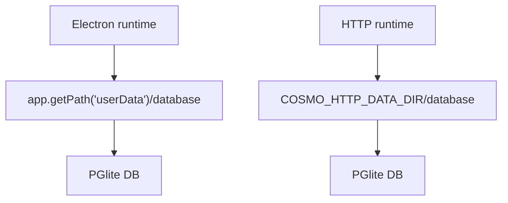

# Dual Runtime Spec: Runtime Targets

## Status

Accepted for v1. The repository builds two runtime targets from the same renderer, shared core package, controller source of truth, and chat streaming service.

## Targets

| Target     | Entry                    | Purpose                                                                                  |
| ---------- | ------------------------ | ---------------------------------------------------------------------------------------- |
| `electron` | `src/main/index.ts`      | Desktop application packaged with Electron Forge.                                        |
| `http`     | `src/main/http/index.ts` | Local single-user NestJS service that serves the static renderer and `/api/*` endpoints. |

## Environment Contract

| Variable                     | Values/default                                           | Used by                                                    |
| ---------------------------- | -------------------------------------------------------- | ---------------------------------------------------------- |
| `COSMO_RUNTIME_TARGET`       | `electron` or `http`                                     | Main/runtime scripts and diagnostics.                      |
| `NEXT_PUBLIC_COSMO_BACKEND`  | `electron` or `http`                                     | Renderer build/dev selection for data and chat transports. |
| `NEXT_PUBLIC_COSMO_API_BASE` | `/api` by default                                        | Renderer HTTP RPC and chat transport.                      |
| `COSMO_HTTP_HOST`            | `127.0.0.1` by default                                   | Nest HTTP service bind host.                               |
| `COSMO_HTTP_PORT`            | `4000` by default                                        | Nest HTTP service port.                                    |
| `COSMO_HTTP_DATA_DIR`        | `.cosmo-http` under current working directory by default | HTTP DB and generated local secret key.                    |
| `COSMO_SECRET_KEY`           | optional base64/hex/plaintext key                        | HTTP secret-store override for deployable environments.    |

## Data Directories

Electron and HTTP use separate default data directories. This avoids sharing rows encrypted with incompatible platform secret stores.

The HTTP target is local single-user in v1. It binds to `127.0.0.1` unless `COSMO_HTTP_HOST` is explicitly changed. Remote and multi-user authentication are outside v1 scope.

## Platform Interfaces

`packages/core` must stay runtime-agnostic. Platform concerns are injected behind interfaces:

- `SecretStore`: encrypts/decrypts provider keys and web-search keys.
- `CoreLogger`: gives core code a logging surface without importing Electron main files.

Runtime bindings:

- Electron binds `SecretStore` to `src/main/platform/ElectronSecretStore.ts`, backed by Electron `safeStorage` with the existing base64 fallback behavior.
- HTTP binds `SecretStore` to `packages/core/platform/NodeSecretStore.ts`, backed by AES-GCM using `COSMO_SECRET_KEY` or `COSMO_HTTP_DATA_DIR/secret.key`.
- Electron startup calls `setCoreLogger(logger)` so core logs flow through `electron-log`.
- HTTP currently uses the default console-backed core logger.

## Rules

- Do not import `electron`, `safeStorage`, or `src/main/logger` from `packages/core`.
- Add new platform requirements as core interfaces plus runtime bindings.
- Do not assume Electron and HTTP encrypted database rows are interchangeable.
- Keep HTTP v1 local-only unless an auth and deployment spec is accepted first.
