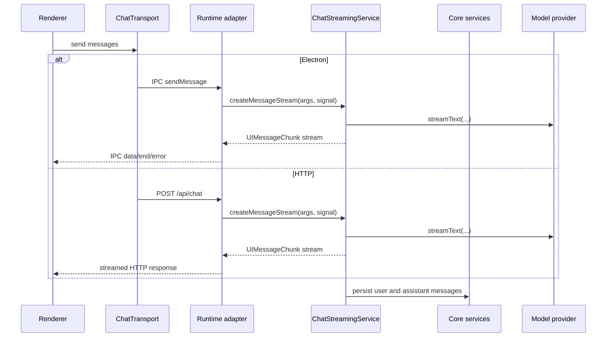

# Dual Runtime Spec: Transport Contract

## Status

Accepted for v1. Renderer data access is selected at build/dev time and hidden behind adapter modules, not component branches.

## Source Of Truth

`src/main/controllers/*` remains the request/response API source of truth.

- `@IpcController("prefix")` defines the group name.
- `@IpcHandler("handler", z.tuple([...]))` defines an Electron IPC handler and an HTTP RPC handler.
- `@IpcOn("event", z.tuple([...]))` remains Electron-only fire-and-forget transport.
- Every `@IpcHandler` must provide a zod tuple schema. Generation fails when a handler is missing one.

## Generated Outputs

`npm run generate-api` writes:

| Output | Purpose |
|---|---|
| `src/preload/api.ts` + `src/preload/api/*` | Electron preload `window.api` surface. |
| `src/main/http/rpc-manifest.ts` | Nest runtime controller constructor manifest. |
| `src/renderer/src/lib/generated-http-api.ts` | Renderer HTTP RPC client. |

## HTTP RPC

Route:

```text
POST /api/rpc/:controller/:handler
```

Request body:

```json
{"args": []}
```

Renderer HTTP calls use `superjson.stringify({args})`, and the Nest RPC controller accepts the SuperJSON body shape. Plain JSON with the same `{ "args": [...] }` shape is also accepted for tests and smoke checks.

Response envelope:

```ts
type RpcEnvelope<T> =
  | {ok: true; result: T}
  | {ok: false; error: {code: string; message: string}};
```

Responses are serialized with SuperJSON so values such as `Date` survive HTTP round trips.

## Error Mapping

| Condition | Status | Code |
|---|---:|---|
| Unknown RPC route | `404` | `NOT_FOUND` |
| Invalid body or invalid args | `400` | `BAD_REQUEST` |
| Controller throws | `500` | `INTERNAL_ERROR` |

The renderer client throws an `Error` for non-2xx responses or `{ok:false}` envelopes.

## Streaming

Streaming is not generated from `@IpcOn` because Electron events and HTTP response streams are different primitives.

| Runtime | Endpoint/channel | Adapter |
|---|---|---|
| Electron | `streaming:sendMessage`, `*-data`, `*-end`, `*-error` | `IpcChatTransport` |
| HTTP | `POST /api/chat` | AI SDK `DefaultChatTransport` |
| HTTP reserved | `GET /api/chat/:chatId/stream` returns `204` | Future resume-stream support |

Both adapters call `ChatStreamingService`, which owns model selection inputs, persona application, tool wiring, and message persistence.



## Renderer Boundary

Presentation components must not branch on runtime. Runtime selection lives in:

- `src/renderer/src/lib/app-data-source.ts` for request/response data flows.
- `src/renderer/src/chat-transport.ts` for chat streaming.
